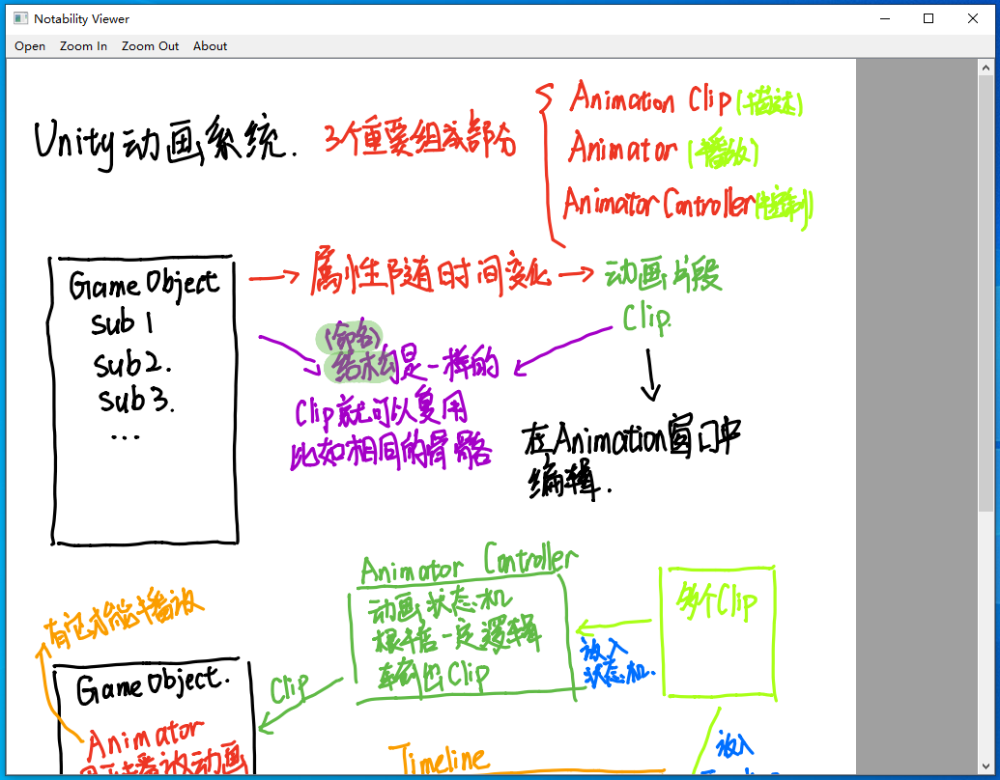

# NotabilityViewer
Open and View your Notability note file (*.note) on Windows

> Tested on: Windows 10 / Python 3.11.3 / Notability 11.8.9



## Usage
### Download the pre-built version

- [Version 0.1.0](https://github.com/GZhonghui/NotabilityViewer/releases/tag/v0.1.0)

### Run from source code
```
git clone https://github.com/GZhonghui/NotabilityViewer.git
cd NotabilityViewer

# virtualenv is recommended
python -m pip install virtualenv
python -m venv nv
.\nv\Scripts\activate.bat

python -m pip install -r requirements.txt
python main.py
```

## Limitations
- Plain text / Image / Recording is not supported for now
- Read only

## Thanks

- https://jvns.ca/blog/2018/03/31/reverse-engineering-notability-format/
- https://github.com/mrandri19/notability2svg-python
